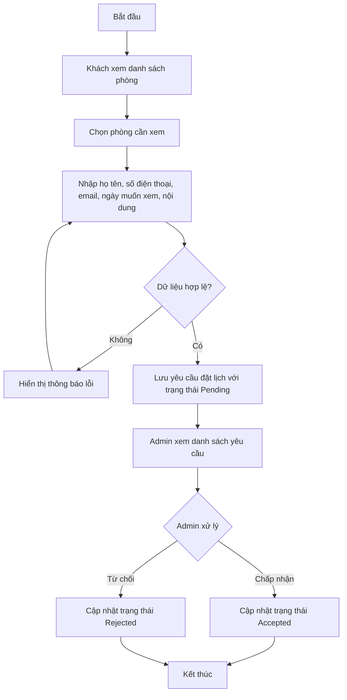
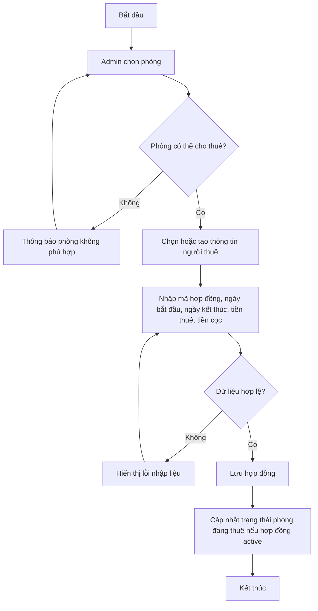
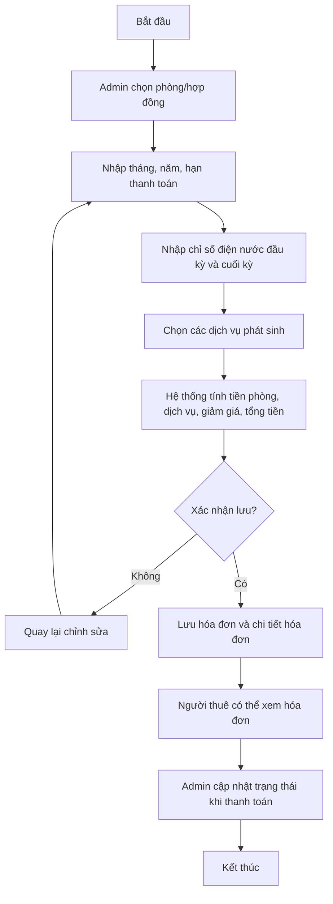
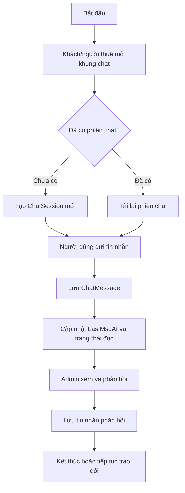
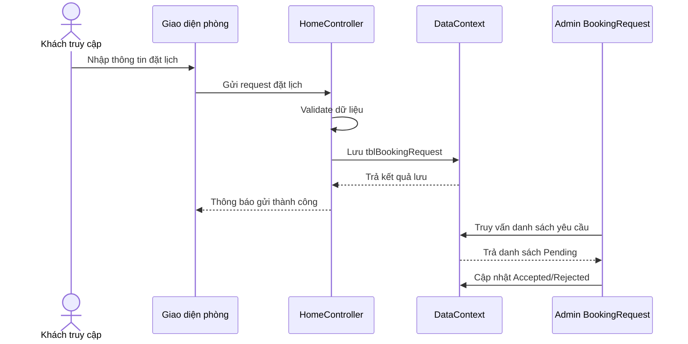
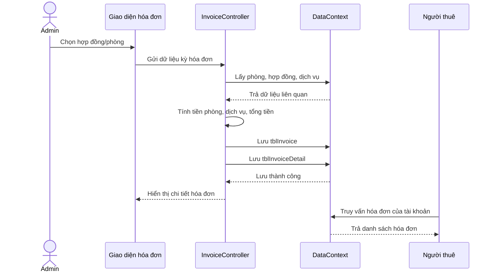
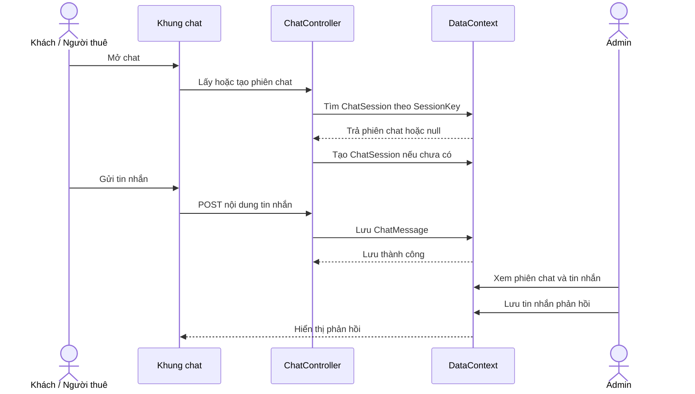
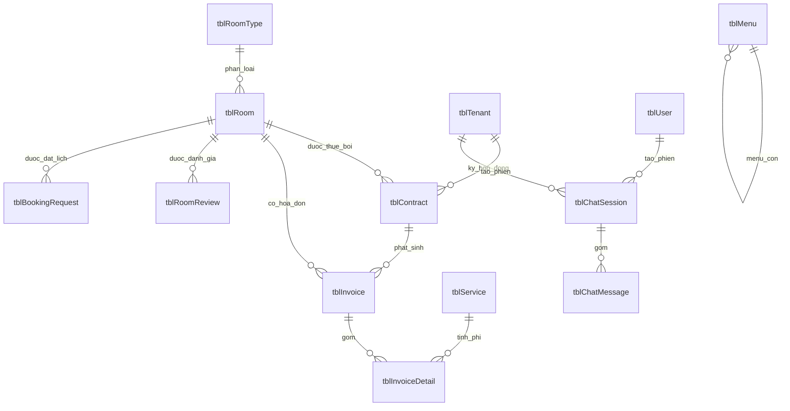

# HỆ THỐNG QUẢN LÝ PHÒNG TRỌ

Tài liệu này được biên soạn theo hướng phục vụ báo cáo đồ án chuyên ngành cho đề tài **"Xây dựng hệ thống quản lý phòng trọ"**. Nội dung tập trung vào cơ sở lý thuyết, phân tích thiết kế hệ thống, sơ đồ nghiệp vụ, thiết kế cơ sở dữ liệu và kết quả triển khai.

Mục tiêu của đề tài là xây dựng một website hỗ trợ chủ trọ quản lý phòng, loại phòng, người thuê, hợp đồng, hóa đơn, dịch vụ, bài viết, đánh giá, yêu cầu đặt lịch xem phòng và trao đổi với khách hàng thông qua chức năng chat trực tuyến.

---

## Chương 2. Cơ Sở Lý Thuyết

### 2.1. Bài toán quản lý phòng trọ

Quản lý phòng trọ là bài toán liên quan đến việc theo dõi tình trạng phòng, thông tin người thuê, hợp đồng thuê, chi phí dịch vụ và hóa đơn thanh toán theo từng kỳ. Nếu thực hiện thủ công bằng sổ sách, file Excel hoặc tin nhắn rời rạc, chủ trọ dễ gặp các vấn đề như thất lạc dữ liệu, tính sai tiền điện nước, khó kiểm tra lịch sử thuê phòng và khó tổng hợp doanh thu.

Hệ thống quản lý phòng trọ giúp số hóa quy trình nghiệp vụ, tập trung dữ liệu vào một cơ sở dữ liệu thống nhất, đồng thời cung cấp giao diện để chủ trọ, người thuê và khách truy cập tra cứu thông tin nhanh chóng hơn.

### 2.2. Mô hình MVC

Dự án sử dụng mô hình **MVC (Model - View - Controller)** trong ASP.NET Core:

| Thành phần | Vai trò trong hệ thống |
| --- | --- |
| Model | Biểu diễn dữ liệu nghiệp vụ như phòng, người thuê, hợp đồng, hóa đơn, dịch vụ, người dùng, đánh giá, lịch xem phòng và chat |
| View | Hiển thị giao diện bằng Razor View, HTML, CSS, Bootstrap và JavaScript |
| Controller | Tiếp nhận request, xử lý nghiệp vụ, truy xuất dữ liệu qua EF Core và trả kết quả về View |

Việc áp dụng MVC giúp mã nguồn dễ bảo trì, tách rõ giao diện với xử lý nghiệp vụ và phù hợp với hệ thống có nhiều nhóm chức năng như trang khách, tài khoản người thuê và khu vực quản trị.

### 2.3. ASP.NET Core và Entity Framework Core

Hệ thống được xây dựng trên **.NET 8** với ASP.NET Core MVC. ASP.NET Core hỗ trợ routing, middleware, session, static files và tích hợp tốt với Entity Framework Core.

**Entity Framework Core** được dùng làm ORM để ánh xạ các lớp C# trong thư mục `Models` sang bảng dữ liệu SQL Server. Lớp `DataContext` trong `Areas/Admin/Data/DataContext.cs` khai báo các `DbSet` và cấu hình khóa ngoại, ràng buộc duy nhất, kiểu dữ liệu tiền tệ, cũng như hành vi xóa dữ liệu.

### 2.4. SQL Server

SQL Server được sử dụng để lưu trữ dữ liệu quan hệ của hệ thống. Các nhóm dữ liệu chính gồm:

- Dữ liệu phòng và loại phòng.
- Dữ liệu người thuê và tài khoản người dùng.
- Dữ liệu hợp đồng thuê phòng.
- Dữ liệu hóa đơn, chi tiết hóa đơn và dịch vụ.
- Dữ liệu bài viết, menu, đánh giá.
- Dữ liệu yêu cầu đặt lịch xem phòng và chat.

Việc dùng cơ sở dữ liệu quan hệ giúp đảm bảo tính toàn vẹn thông qua khóa chính, khóa ngoại, ràng buộc duy nhất và các kiểu dữ liệu phù hợp.

### 2.5. Razor View, Bootstrap, JavaScript và Session

Giao diện người dùng được xây dựng bằng Razor View kết hợp Bootstrap và JavaScript. Bootstrap giúp giao diện hiển thị tốt trên nhiều kích thước màn hình, còn JavaScript hỗ trợ các tương tác như lọc phòng, gửi form, chat và cập nhật giao diện động.

Hệ thống sử dụng Session để lưu thông tin đăng nhập và phân biệt nhóm người dùng:

- **Admin/Chủ trọ**: quản lý toàn bộ dữ liệu hệ thống.
- **Người thuê**: xem thông tin cá nhân, hóa đơn và trao đổi với admin.
- **Khách truy cập**: xem phòng, xem bài viết, gửi đánh giá, đặt lịch xem phòng và chat.

### 2.6. Thư viện hỗ trợ

| Thư viện | Mục đích sử dụng |
| --- | --- |
| `Microsoft.EntityFrameworkCore.SqlServer` | Kết nối và thao tác dữ liệu với SQL Server thông qua Entity Framework Core |
| `Microsoft.EntityFrameworkCore.Design` | Hỗ trợ migration và thiết kế cơ sở dữ liệu trong quá trình phát triển |
| `SendGrid` | Gửi email thông báo từ hệ thống thông qua lớp `EmailHelper` |
| `elFinder.NetCore` | Quản lý file và hình ảnh trong khu vực quản trị |
| `MiniWord` | Xuất file Word cho hợp đồng thuê phòng và hóa đơn từ các mẫu `.docx` |

---

## Chương 3. Nội Dung Nghiên Cứu

### 3.1. Khảo sát hiện trạng

Trong thực tế, nhiều chủ trọ vẫn quản lý thông tin bằng sổ ghi chép, Excel hoặc tin nhắn. Cách làm này có một số hạn chế:

- Khó theo dõi trạng thái từng phòng theo thời gian thực.
- Dễ nhầm lẫn khi tính tiền điện, nước và dịch vụ.
- Khó kiểm tra lịch sử hợp đồng và thanh toán.
- Khó tổng hợp doanh thu theo tháng.
- Người thuê khó tra cứu hóa đơn hoặc thông tin phòng.
- Việc phản hồi yêu cầu xem phòng và tin nhắn khách hàng chưa tập trung.

Từ các hạn chế trên, đề tài đề xuất xây dựng hệ thống web quản lý tập trung, giúp chủ trọ giảm thao tác thủ công và nâng cao chất lượng phục vụ người thuê.

### 3.2. Tác nhân sử dụng hệ thống

| Tác nhân | Mô tả | Chức năng chính |
| --- | --- | --- |
| Khách truy cập | Người chưa đăng nhập hoặc khách có nhu cầu tìm phòng | Xem phòng, tìm kiếm/lọc phòng, xem chi tiết phòng, xem bài viết, gửi đánh giá, đặt lịch xem phòng, chat |
| Người thuê | Người đang thuê phòng và có tài khoản/thông tin thuê | Đăng nhập, xem/cập nhật thông tin cá nhân, đổi mật khẩu, xem hóa đơn, chat với admin |
| Admin/Chủ trọ | Người quản lý hệ thống | Quản lý phòng, loại phòng, người thuê, hợp đồng, hóa đơn, dịch vụ, bài viết, người dùng, đặt lịch, đánh giá, chat, file |
| Hệ thống | Thành phần xử lý tự động | Lưu dữ liệu, kiểm tra ràng buộc, tính tổng hóa đơn, cập nhật trạng thái, ghi nhận tin nhắn |

### 3.3. Yêu cầu chức năng

#### 3.3.1. Chức năng phía khách truy cập

- Xem trang chủ và danh sách phòng đang được hiển thị.
- Tìm kiếm/lọc phòng theo giá, diện tích, tầng, loại phòng hoặc vị trí.
- Xem chi tiết phòng, hình ảnh, giá thuê, diện tích, mô tả và đánh giá.
- Gửi yêu cầu đặt lịch xem phòng.
- Gửi đánh giá chung hoặc đánh giá theo phòng.
- Đăng ký, đăng nhập tài khoản.
- Chat với quản trị viên.

#### 3.3.2. Chức năng phía người thuê

- Đăng nhập vào hệ thống.
- Xem và cập nhật thông tin cá nhân.
- Đổi mật khẩu.
- Xem danh sách hóa đơn liên quan.
- Theo dõi trạng thái thanh toán.
- Chat với quản trị viên.

#### 3.3.3. Chức năng phía admin

- Quản lý tài khoản quản trị và người dùng.
- Quản lý loại phòng.
- Quản lý phòng trọ.
- Quản lý người thuê.
- Quản lý hợp đồng thuê phòng.
- Quản lý dịch vụ.
- Lập, xem, sửa và quản lý hóa đơn.
- Xem hóa đơn đến hạn trong tháng.
- Quản lý yêu cầu đặt lịch xem phòng.
- Quản lý bài viết, menu, đánh giá.
- Chat với khách hàng hoặc người thuê.
- Quản lý file, hình ảnh phục vụ nội dung website.

### 3.4. Yêu cầu phi chức năng

- Giao diện dễ sử dụng, phù hợp với người dùng phổ thông.
- Dữ liệu lưu trữ tập trung, hạn chế trùng lặp.
- Danh sách dữ liệu có tìm kiếm, lọc và phân trang.
- Khu vực admin phải được bảo vệ bằng kiểm tra quyền.
- Các trường quan trọng phải được kiểm tra hợp lệ trước khi lưu.
- Hệ thống có khả năng mở rộng thêm thanh toán online, thông báo thời gian thực, thống kê nâng cao hoặc xuất PDF/Word.

---

## 3.5. Biểu Đồ Use Case

Sơ đồ dưới đây mô tả các nhóm chức năng chính theo từng tác nhân. Khi đưa vào báo cáo Word, có thể chụp lại sơ đồ Mermaid hoặc vẽ lại bằng Draw.io/StarUML theo nội dung này.

```mermaid
flowchart LR
    Guest[Khách truy cập]
    Tenant[Người thuê]
    Admin[Admin / Chủ trọ]

    subgraph Public[Nhóm chức năng công khai]
        UC1((Xem danh sách phòng))
        UC2((Tìm kiếm / lọc phòng))
        UC3((Xem chi tiết phòng))
        UC4((Đặt lịch xem phòng))
        UC5((Gửi đánh giá))
        UC6((Đăng ký / đăng nhập))
        UC7((Chat với admin))
        UC8((Xem bài viết))
    end

    subgraph TenantUC[Nhóm chức năng người thuê]
        UC9((Xem thông tin cá nhân))
        UC10((Cập nhật tài khoản))
        UC11((Đổi mật khẩu))
        UC12((Xem hóa đơn))
        UC13((Theo dõi thanh toán))
    end

    subgraph AdminUC[Nhóm chức năng quản trị]
        UC14((Quản lý phòng))
        UC15((Quản lý loại phòng))
        UC16((Quản lý người thuê))
        UC17((Quản lý hợp đồng))
        UC18((Quản lý hóa đơn))
        UC19((Quản lý dịch vụ))
        UC20((Quản lý bài viết / menu))
        UC21((Quản lý đặt lịch))
        UC22((Quản lý đánh giá))
        UC23((Quản lý chat))
        UC24((Quản lý người dùng))
        UC25((Quản lý file))
    end

    Guest --> UC1
    Guest --> UC2
    Guest --> UC3
    Guest --> UC4
    Guest --> UC5
    Guest --> UC6
    Guest --> UC7
    Guest --> UC8

    Tenant --> UC9
    Tenant --> UC10
    Tenant --> UC11
    Tenant --> UC12
    Tenant --> UC13
    Tenant --> UC7

    Admin --> UC14
    Admin --> UC15
    Admin --> UC16
    Admin --> UC17
    Admin --> UC18
    Admin --> UC19
    Admin --> UC20
    Admin --> UC21
    Admin --> UC22
    Admin --> UC23
    Admin --> UC24
    Admin --> UC25
```



---

## 3.6. Sơ Đồ Hoạt Động

### 3.6.1. Hoạt động đặt lịch xem phòng



### 3.6.2. Hoạt động tạo hợp đồng thuê phòng



### 3.6.3. Hoạt động lập hóa đơn



### 3.6.4. Hoạt động chat



---

## 3.7. Sơ Đồ Tuần Tự

### 3.7.1. Tuần tự đặt lịch xem phòng



### 3.7.2. Tuần tự lập hóa đơn



### 3.7.3. Tuần tự chat



---

## 3.8. Thiết Kế Kiến Trúc Hệ Thống

Hệ thống được tổ chức theo mô hình ASP.NET Core MVC:

```text
Người dùng / Admin
        |
        v
Razor View + JavaScript
        |
        v
Controller / Area Controller
        |
        v
Model / ViewModel / Service
        |
        v
Entity Framework Core - DataContext
        |
        v
SQL Server
```

Cấu trúc thư mục chính:

| Thư mục/Tệp | Vai trò |
| --- | --- |
| `Controllers` | Controller phía người dùng/khách truy cập |
| `Areas/Admin/Controllers` | Controller khu vực quản trị |
| `Models` | Entity và ViewModel dùng trong hệ thống |
| `Areas/Admin/Data/DataContext.cs` | Cấu hình DbContext, DbSet, quan hệ và ràng buộc |
| `Views` | Razor View phía người dùng |
| `Areas/Admin/Views` | Razor View phía admin |
| `Services` | Dịch vụ hỗ trợ như tích hợp AI chat |
| `Utilities` | Hàm tiện ích và email helper |
| `wwwroot` | CSS, JavaScript, hình ảnh, template Word và tài nguyên tĩnh |

---

## 3.9. Thiết Kế Cơ Sở Dữ Liệu

### 3.9.1. Sơ đồ quan hệ dữ liệu tổng quát



### 3.9.2. Danh sách bảng dữ liệu

| Bảng | Mục đích |
| --- | --- |
| `tblRoomType` | Lưu loại phòng |
| `tblRoom` | Lưu thông tin phòng trọ |
| `tblTenant` | Lưu thông tin người thuê |
| `tblContract` | Lưu hợp đồng thuê phòng |
| `tblService` | Lưu danh mục dịch vụ tính phí |
| `tblInvoice` | Lưu hóa đơn hàng tháng |
| `tblInvoiceDetail` | Lưu chi tiết các khoản thu trong hóa đơn |
| `tblPost` | Lưu bài viết/thông báo |
| `tblMenu` | Lưu menu điều hướng website |
| `tblUser` | Lưu tài khoản người dùng/admin |
| `tblReview` | Lưu đánh giá chung |
| `tblRoomReview` | Lưu đánh giá theo phòng |
| `tblBookingRequest` | Lưu yêu cầu đặt lịch xem phòng/tin nhắn liên hệ |
| `tblChatSession` | Lưu phiên chat |
| `tblChatMessage` | Lưu tin nhắn trong phiên chat |

### 3.9.3. Chi tiết các bảng chính

#### `tblRoomType` - loại phòng

| Trường | Kiểu/ghi chú | Ý nghĩa |
| --- | --- | --- |
| `RoomTypeId` | int, PK | Mã loại phòng |
| `RoomTypeName` | string(100), unique, required | Tên loại phòng |
| `Description` | string(500), nullable | Mô tả |
| `SortOrder` | int | Thứ tự hiển thị |
| `IsActive` | bool | Trạng thái kích hoạt |
| `CreatedAt` | DateTime | Ngày tạo |

#### `tblRoom` - phòng trọ

| Trường | Kiểu/ghi chú | Ý nghĩa |
| --- | --- | --- |
| `RoomId` | int, PK | Mã phòng |
| `RoomCode` | string(20), unique, required | Mã phòng hiển thị/quản lý |
| `RoomName` | string(150), required | Tên phòng |
| `RoomTypeId` | int, FK | Loại phòng |
| `RoomPrice` | decimal(18,2) | Giá thuê/tháng |
| `DefaultDeposit` | decimal(18,2) | Tiền cọc mặc định |
| `Area` | double | Diện tích |
| `Floor` | int | Tầng |
| `MaxOccupants` | int | Số người tối đa |
| `Description` | string, nullable | Mô tả chi tiết |
| `ThumbnailImage` | string(300), nullable | Ảnh đại diện |
| `Address` | string(255), nullable | Địa chỉ |
| `Latitude`, `Longitude` | double?, nullable | Tọa độ vị trí |
| `Status` | enum | Available, Occupied, Maintenance |
| `IsPublished` | bool | Có hiển thị trên website hay không |
| `CreatedAt`, `UpdatedAt` | DateTime | Thông tin audit |

#### `tblTenant` - người thuê

| Trường | Kiểu/ghi chú | Ý nghĩa |
| --- | --- | --- |
| `TenantId` | int, PK | Mã người thuê |
| `FullName` | string(100), required | Họ tên |
| `IdentityNumber` | string(20), unique, required | Số CCCD/CMND |
| `Phone` | string(15), nullable | Số điện thoại |
| `Email` | string(200), nullable | Email |
| `DateOfBirth` | DateOnly?, nullable | Ngày sinh |
| `Gender` | string(10), nullable | Giới tính |
| `PermanentAddress` | string(500), nullable | Địa chỉ thường trú |
| `IdentityFrontImage`, `IdentityBackImage` | string(200), nullable | Ảnh giấy tờ |
| `Avatar` | string(200), nullable | Ảnh đại diện |
| `Username` | string(50), unique nếu khác null | Tên đăng nhập người thuê |
| `PasswordHash` | string(256), nullable | Mật khẩu đã băm |
| `IsActive` | bool | Trạng thái tài khoản |
| `CreatedAt`, `UpdatedAt` | DateTime | Thông tin audit |

#### `tblContract` - hợp đồng

| Trường | Kiểu/ghi chú | Ý nghĩa |
| --- | --- | --- |
| `ContractId` | int, PK | Mã hợp đồng |
| `ContractCode` | string(30), unique, required | Số/mã hợp đồng |
| `RoomId` | int, FK | Phòng thuê |
| `TenantId` | int, FK | Người thuê đại diện |
| `StartDate`, `EndDate` | DateTime | Thời hạn hợp đồng |
| `MonthlyRent` | decimal(18,2) | Tiền thuê/tháng |
| `Deposit` | decimal(18,2) | Tiền đặt cọc |
| `PaymentDayOfMonth` | int, 1-28 | Ngày thanh toán hằng tháng |
| `InitialElectricIndex` | double | Chỉ số điện ban đầu |
| `InitialWaterIndex` | double | Chỉ số nước ban đầu |
| `Terms` | string, nullable | Điều khoản |
| `Notes` | string(500), nullable | Ghi chú |
| `Status` | enum | Active, Expired, Terminated |
| `ActualEndDate` | DateTime?, nullable | Ngày chấm dứt thực tế |
| `TerminationReason` | string(500), nullable | Lý do chấm dứt |

#### `tblInvoice` - hóa đơn

| Trường | Kiểu/ghi chú | Ý nghĩa |
| --- | --- | --- |
| `InvoiceId` | int, PK | Mã hóa đơn |
| `InvoiceCode` | string(30), unique, required | Số hóa đơn |
| `RoomId` | int, FK | Phòng phát sinh hóa đơn |
| `ContractId` | int, FK | Hợp đồng liên quan |
| `BillingMonth`, `BillingYear` | int | Kỳ hóa đơn |
| `DueDate` | DateTime | Hạn thanh toán |
| `ElectricIndexStart`, `ElectricIndexEnd` | double | Chỉ số điện |
| `WaterIndexStart`, `WaterIndexEnd` | double | Chỉ số nước |
| `RoomRentAmount` | decimal(18,2) | Tiền phòng |
| `TotalServiceAmount` | decimal(18,2) | Tổng tiền dịch vụ |
| `Discount` | decimal(18,2) | Giảm giá |
| `TotalAmount` | decimal(18,2) | Tổng tiền phải trả |
| `Status` | enum | Unpaid, Paid, Overdue |
| `PaidDate` | DateTime?, nullable | Ngày thanh toán |
| `PaymentMethod` | string(200), nullable | Phương thức thanh toán |
| `Notes` | string(500), nullable | Ghi chú |

#### `tblInvoiceDetail` - chi tiết hóa đơn

| Trường | Kiểu/ghi chú | Ý nghĩa |
| --- | --- | --- |
| `InvoiceDetailId` | int, PK | Mã chi tiết |
| `InvoiceId` | int, FK | Hóa đơn |
| `ServiceId` | int?, FK nullable | Dịch vụ liên quan |
| `Description` | string(200), nullable | Mô tả khoản thu |
| `Quantity` | double | Số lượng/đơn vị tiêu thụ |
| `UnitPrice` | decimal(18,2) | Đơn giá tại thời điểm lập |
| `Amount` | decimal(18,2) | Thành tiền |

#### `tblService` - dịch vụ

| Trường | Kiểu/ghi chú | Ý nghĩa |
| --- | --- | --- |
| `ServiceId` | int, PK | Mã dịch vụ |
| `ServiceName` | string(100), required | Tên dịch vụ |
| `ServiceType` | enum | Electric, Water, Garbage, Wifi, Parking, Other |
| `PricingMethod` | enum | PerUnit hoặc FixedMonthly |
| `UnitPrice` | decimal(18,2) | Đơn giá |
| `Unit` | string(20), nullable | Đơn vị tính |
| `Description` | string(200), nullable | Mô tả |
| `IsActive` | bool | Trạng thái kích hoạt |

#### Các bảng nội dung, đánh giá và chat

| Bảng | Trường quan trọng | Ghi chú |
| --- | --- | --- |
| `tblPost` | `Title`, `Slug`, `Summary`, `Content`, `ThumbnailImage`, `Category`, `IsPinned`, `IsPublished`, `PublishedAt`, `ViewCount`, `MetaTitle`, `MetaDescription` | `Slug` là duy nhất |
| `tblMenu` | `MenuName`, `Url`, `Icon`, `ParentMenuId`, `SortOrder`, `Position`, `OpenNewTab`, `IsActive` | Có quan hệ menu cha - con |
| `tblUser` | `Username`, `Email`, `PasswordHash`, `FullName`, `Phone`, `Avatar`, `Role`, `IsActive` | `Username` và `Email` là duy nhất |
| `tblReview` | `FullName`, `Email`, `Title`, `Content`, `Rating`, `IsApproved` | Đánh giá chung trên website |
| `tblRoomReview` | `RoomId`, `TenantId`, `UserId`, `FullName`, `Rating`, `Comment`, `IsApproved` | Đánh giá theo phòng |
| `tblBookingRequest` | `RoomId`, `FullName`, `Phone`, `Email`, `PreferredDate`, `Message`, `RequestType`, `Status`, `AdminNote` | Đặt lịch xem phòng hoặc tin nhắn liên hệ |
| `tblChatSession` | `SessionKey`, `GuestName`, `GuestPhone`, `IsOpen`, `LastMsgAt`, `TenantId`, `UserId` | Phiên chat theo khách/người thuê |
| `tblChatMessage` | `SessionId`, `Content`, `SenderType`, `IsReadByAdmin`, `IsReadByGuest`, `CreatedAt` | Tin nhắn trong từng phiên |

### 3.9.4. Ràng buộc và quan hệ dữ liệu

- `tblRoomType.RoomTypeName` là duy nhất.
- `tblRoom.RoomCode` là duy nhất.
- `tblTenant.IdentityNumber` là duy nhất.
- `tblTenant.Username` là duy nhất nếu có giá trị.
- `tblContract.ContractCode` là duy nhất.
- `tblInvoice.InvoiceCode` là duy nhất.
- `tblPost.Slug` là duy nhất.
- `tblUser.Username` và `tblUser.Email` là duy nhất.
- Các trường tiền tệ dùng `decimal(18,2)`.
- Một loại phòng có nhiều phòng.
- Một phòng có nhiều hợp đồng, hóa đơn, đánh giá phòng và yêu cầu đặt lịch.
- Một người thuê có nhiều hợp đồng.
- Một hợp đồng có nhiều hóa đơn.
- Một hóa đơn có nhiều chi tiết hóa đơn.
- Một dịch vụ có thể xuất hiện trong nhiều chi tiết hóa đơn.
- Một phiên chat có nhiều tin nhắn.
- Khi xóa hóa đơn, chi tiết hóa đơn bị xóa theo.
- Khi xóa phòng, đánh giá phòng và yêu cầu đặt lịch liên quan có thể bị xóa theo cấu hình hiện tại.
- Một số quan hệ quan trọng như phòng - hợp đồng, người thuê - hợp đồng, phòng - hóa đơn được cấu hình `Restrict` để tránh xóa dữ liệu làm mất lịch sử nghiệp vụ.

---

## Chương 4. Kết Quả Nghiên Cứu

### 4.1. Các bước triển khai hệ thống

1. Khởi tạo project ASP.NET Core MVC trên nền .NET 8.
2. Cấu hình `QuanLyPhongTro.csproj` với các thư viện cần thiết.
3. Cấu hình chuỗi kết nối SQL Server trong `appsettings.json`.
4. Xây dựng các entity trong thư mục `Models`.
5. Khai báo `DataContext` và cấu hình quan hệ dữ liệu.
6. Xây dựng giao diện người dùng và giao diện quản trị.
7. Xây dựng các module nghiệp vụ: phòng, người thuê, hợp đồng, hóa đơn, dịch vụ, bài viết, đánh giá, đặt lịch, chat.
8. Kiểm tra các luồng nghiệp vụ chính.

### 4.2. Kết quả chức năng đạt được

| Module | Kết quả đạt được |
| --- | --- |
| Quản lý phòng | Thêm, sửa, xem chi tiết, tìm kiếm phòng; theo dõi giá, diện tích, tầng, trạng thái, hình ảnh và hiển thị website |
| Quản lý loại phòng | Phân nhóm phòng theo loại, hỗ trợ hiển thị và lọc dữ liệu |
| Quản lý người thuê | Lưu thông tin cá nhân, CCCD/CMND, liên hệ, tài khoản và liên kết hợp đồng |
| Quản lý hợp đồng | Tạo hợp đồng thuê, theo dõi thời hạn, tiền thuê, tiền cọc, trạng thái và chỉ số điện nước ban đầu |
| Quản lý dịch vụ | Lưu dịch vụ điện, nước, rác, wifi, gửi xe hoặc dịch vụ khác; hỗ trợ tính hóa đơn |
| Quản lý hóa đơn | Lập hóa đơn theo tháng, tính tiền phòng, dịch vụ, giảm giá, tổng tiền và trạng thái thanh toán |
| Đặt lịch xem phòng | Khách gửi yêu cầu, admin tiếp nhận và cập nhật trạng thái xử lý |
| Chat | Khách/người thuê trao đổi với admin, lưu phiên chat và tin nhắn |
| Bài viết và menu | Quản lý nội dung website, menu điều hướng và thông tin hiển thị |
| Đánh giá | Khách gửi đánh giá chung hoặc đánh giá theo phòng |
| Tài khoản và phân quyền | Hỗ trợ đăng nhập, đăng ký, đổi mật khẩu, khu vực admin riêng |
| Quản lý file | Hỗ trợ upload/quản lý file phục vụ bài viết và hình ảnh |

### 4.3. Kết quả giao diện

Hệ thống có hai nhóm giao diện chính:

- **Giao diện người dùng**: phục vụ khách truy cập và người thuê, tập trung vào tìm phòng, xem chi tiết phòng, đặt lịch, đăng nhập, xem hóa đơn, xem bài viết, đánh giá và chat.
- **Giao diện quản trị**: phục vụ admin, tập trung vào quản lý dữ liệu dạng bảng, thêm, sửa, xem chi tiết, tìm kiếm và xử lý nghiệp vụ.

Giao diện sử dụng Razor View, Bootstrap và JavaScript nên có khả năng hiển thị tốt trên nhiều kích thước màn hình.

### 4.4. Kịch bản kiểm thử đề xuất

| STT | Chức năng | Dữ liệu kiểm thử | Kết quả mong đợi |
| --- | --- | --- | --- |
| 1 | Đăng nhập | Tài khoản đúng | Đăng nhập thành công |
| 2 | Đăng nhập | Sai mật khẩu | Hiển thị thông báo lỗi |
| 3 | Tìm kiếm phòng | Nhập khoảng giá/loại phòng | Hiển thị phòng phù hợp |
| 4 | Đặt lịch | Nhập đủ thông tin | Tạo yêu cầu đặt lịch trạng thái Pending |
| 5 | Xử lý đặt lịch | Admin chấp nhận/từ chối | Trạng thái chuyển Accepted/Rejected |
| 6 | Tạo hợp đồng | Chọn phòng và người thuê hợp lệ | Hợp đồng được lưu |
| 7 | Lập hóa đơn | Nhập chỉ số điện nước và dịch vụ | Tổng tiền được tính đúng |
| 8 | Xem hóa đơn | Người thuê đăng nhập | Hiển thị hóa đơn liên quan |
| 9 | Chat | Gửi tin nhắn | Tin nhắn được lưu và hiển thị |
| 10 | Truy cập admin | Chưa đăng nhập admin | Bị chặn hoặc chuyển hướng |

### 4.5. Đánh giá kết quả đạt được

Hệ thống đã đáp ứng các yêu cầu chính của bài toán quản lý phòng trọ:

- Quản lý tập trung thông tin phòng, loại phòng, người thuê, hợp đồng và hóa đơn.
- Hỗ trợ tính toán hóa đơn tiền phòng và dịch vụ.
- Hỗ trợ khách tìm kiếm phòng và gửi yêu cầu đặt lịch.
- Hỗ trợ trao đổi giữa khách/người thuê và admin qua chat.
- Cung cấp khu vực quản trị riêng cho chủ trọ.
- Dữ liệu được tổ chức theo mô hình quan hệ, có ràng buộc và liên kết rõ ràng.

### 4.6. Hạn chế còn tồn tại

- Chưa tích hợp cổng thanh toán trực tuyến như VNPay, MoMo hoặc chuyển khoản tự động.
- Chưa có thông báo thời gian thực bằng SignalR cho chat và hóa đơn.
- Chưa có dashboard doanh thu/công nợ nâng cao theo tháng, quý, năm.
- Chưa có ứng dụng di động riêng cho người thuê.
- Chưa áp dụng đầy đủ ASP.NET Core Identity cho xác thực và phân quyền chuẩn.
- Chưa có bộ kiểm thử tự động đầy đủ.

### 4.7. Hướng phát triển

- Tích hợp thanh toán online.
- Bổ sung dashboard thống kê doanh thu, công nợ và tỷ lệ lấp đầy phòng.
- Tích hợp SignalR để chat và thông báo theo thời gian thực.
- Xây dựng ứng dụng mobile cho người thuê.
- Nâng cấp xác thực bằng ASP.NET Core Identity.
- Bổ sung chức năng xuất hợp đồng, hóa đơn ra Word/PDF.
- Bổ sung lịch nhắc thanh toán và gửi email tự động.

---

## Phụ Lục. Thông Tin Kỹ Thuật Dự Án

### Công nghệ sử dụng

- .NET 8.
- ASP.NET Core MVC.
- Entity Framework Core.
- SQL Server.
- Razor View.
- Bootstrap.
- JavaScript.
- Session.

### Cấu trúc thư mục chính

```text
QuanLyPhongTro/
|-- Areas/
|   `-- Admin/
|       |-- Attributes/
|       |-- Controllers/
|       |-- Data/
|       |-- Models/
|       `-- Views/
|-- Components/
|-- Controllers/
|-- Models/
|-- Services/
|-- Utilities/
|-- Views/
|-- wwwroot/
|-- Program.cs
|-- appsettings.json
|-- QuanLyPhongTro.csproj
`-- QuanLyPhongTro.sln
```

### Hướng dẫn chạy dự án

1. Cài đặt .NET SDK 8.0.
2. Cài đặt SQL Server.
3. Cập nhật chuỗi kết nối trong `appsettings.json`.
4. Chạy các lệnh:

```bash
dotnet restore
dotnet build
dotnet run
```

5. Mở trình duyệt theo địa chỉ được hiển thị trong terminal.

### Gợi ý hình minh họa đưa vào báo cáo

- Trang chủ.
- Danh sách phòng.
- Chi tiết phòng.
- Form đặt lịch xem phòng.
- Trang quản lý phòng.
- Trang quản lý hợp đồng.
- Trang quản lý hóa đơn.
- Trang quản lý yêu cầu đặt lịch.
- Giao diện chat.
- Sơ đồ use case.
- Sơ đồ hoạt động.
- Sơ đồ tuần tự.
- Sơ đồ cơ sở dữ liệu.
